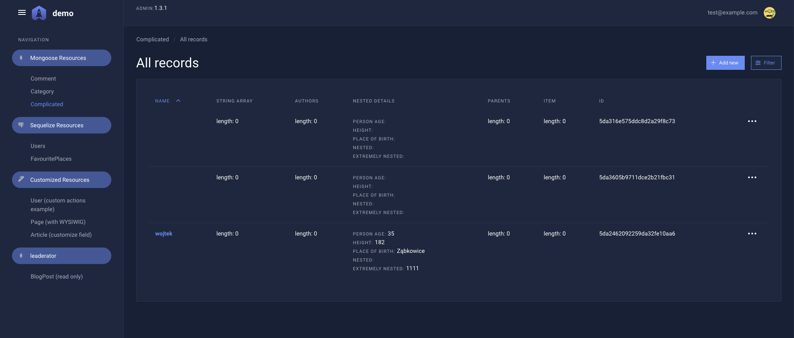
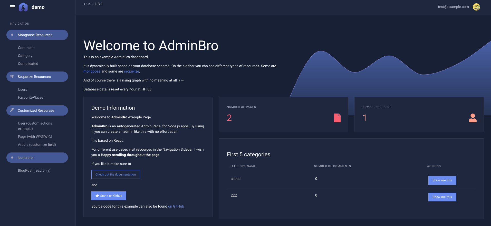

## Dark Theme for AdminBro

### Screenshots




### Installation

Install the theme:

```bash
yarn install admin-bro-theme-dark
```

Setup it in your AdminBro:

```javascript
const theme = require('admin-bro-theme-dark')

new AdminBro({
  branding: {
    theme
  }
})
```